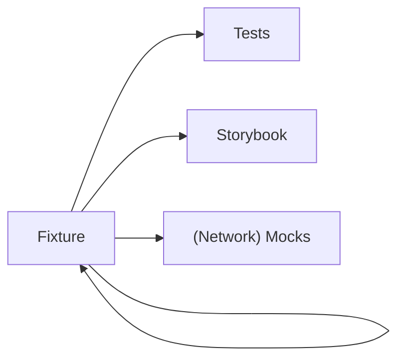

<!-- markdownlint-disable -->

# Workshopping Ember with Storybook

Thomas Gossmann

<lucide-house /> <a href="https://gos.si" target="_blank">gos.si</a><br>
<simple-icons-bluesky /> <a href="https://bsky.app/profile/gos.si" target="_blank">gos.si</a><br/>
<simple-icons-github /> <a href="https://github.com/gossi" target="_blank">gossi</a><br>


---

# Problem Statement

My Project: [Sportipedia](https://github.com/gossi/sportipedia)

- Ember on vite + Warp Drive
- Design System: [Hokulea](https://github.com/hokulea/hokulea)
- Better Auth

## Testing?

- I don't want to write test
- I want deterministic tests
- I wanna play!

---

# Workshop?

<figure class="absolute right-8 top-10" style="width: 44%" v-click>
  

  <figcaption class="font-size-2 text-right">
  By <a href="https://unsplash.com/de/@adampatterson?utm_source=unsplash&utm_medium=referral&utm_content=creditCopyText">Adam Patterson</a> on <a href="https://unsplash.com/de/fotos/brauner-holztisch-mit-weissem-druckerpapier-v13x0qU4afA?utm_source=unsplash&utm_medium=referral&utm_content=creditCopyText">Unsplash</a>
  </figcaption>
</figure>

<figure class="absolute left-8 top-23" style="width: 38%" v-click>
  

  <figcaption class="font-size-2">
  By <a href="https://unsplash.com/@sweetmangostudios?utm_source=unsplash&utm_medium=referral&utm_content=creditCopyText">Ricky  Kharawala</a> on <a href="https://unsplash.com/photos/assorted-hand-tool-lot-on-brown-wooden-shelf-4dVDBMAho8c?utm_source=unsplash&utm_medium=referral&utm_content=creditCopyText">Unsplash</a>
  </figcaption>
</figure>

<figure class="absolute left-66 bottom-4" style="width: 44%" v-click>
  

  <figcaption class="font-size-2">
  By <a href="https://unsplash.com/@wengenroad?utm_source=unsplash&utm_medium=referral&utm_content=creditCopyText">s w</a> on <a href="https://unsplash.com/photos/brown-wooden-workbench-mNWsZDYUCFs?utm_source=unsplash&utm_medium=referral&utm_content=creditCopyText">Unsplash</a>
  </figcaption>
</figure>

---

# Digital Workshop


---
layout: full
---


<div class="absolute top-14 h-38 w-115 left-1/2 ml-[-170px]" v-mark="{ at: ['1', '+1'], color: 'green', type: 'box' }"></div>
<div class="absolute top-10 h-4.5 w-115 left-1/2 ml-[-170px]" v-mark="{ at: ['2', '+1'], color: 'red', type: 'box' }"></div>
<div class="absolute bottom-10 h-75 w-115 left-1/2 ml-[-170px]" v-mark="{ at: ['3', '+1'], color: 'red', type: 'box' }"></div>
<div class="absolute top-10 h-118 w-29 left-1/2 ml-[-290px]" v-mark="{ at: '4', color: 'blue', type: 'box' }"></div>

---
layout: section
---

# Hokulea

_Library_ ⋅ _Design System_

<span class="text-xs font-semibold uppercase tracking-[0.2] text-subtle
text-gray-500 mb-[-10px]">Example</span><br> **Basic Usage**

<div class="absolute bottom-10 left-13">

<ph-git-branch/> [https://github.com/hokulea/hokulea](https://github.com/hokulea/hokulea)<br>
<ph-globe/> [https://hokulea.netlify.app/ember/](https://hokulea.netlify.app/ember/)

</div>

---
layout: two-cols-header
---

# Writing Stories

> A story captures the rendered state of a UI component.

::left::

```ts [button.stories.gts (CSF v3) ~i-vscode-icons:file-type-storybook~] {1|4-8|10,12,16}
//               ^^^^^^
import { Button } from './button.gts';
import type { Meta, StoryObj } from 'ember-storybook';

export default {
  title: 'Actions/Button',
  component: Button
} satisfies Meta;

export const Showcase: StoryObj = {};

export const WithIcon: StoryObj = {
  // ...
};

export const Stack: StoryObj = {
  // ...
};
```

::right::

<div style="margin: var(--slidev-code-margin)"></div>

---
layout: full-image-right
image: /sb-button-story.png
backgroundSize: contain
transition: fade
---

# Story

```ts [button.stories.gts ~i-vscode-icons:file-type-storybook~]
import { Button } from './button.gts';
import type { 
  Meta, StoryObj 
} from 'ember-storybook';

export default {
  title: 'Actions/Button',
  component: Button
} satisfies Meta;

export const Showcase: StoryObj = {};

export const WithIcon: StoryObj = {
  // ...
};

export const Stack: StoryObj = {
  // ...
};
```

---
layout: full-image-right
image: /sb-button-docs.png
backgroundSize: contain
---

# Docs

```ts [button.stories.gts ~i-vscode-icons:file-type-storybook~]
import { Button } from './button.gts';
import type { 
  Meta, StoryObj 
} from 'ember-storybook';

export default {
  title: 'Actions/Button',
  component: Button
} satisfies Meta;

export const Showcase: StoryObj = {};

export const WithIcon: StoryObj = {
  // ...
};

export const Stack: StoryObj = {
  // ...
};
```


---
layout: two-cols-header
---

# Docs with Signature

::left::


::right::


---

# Getting Started

<br>

## Requirements

- Ember v6.8
- Storybook v10
- vite

## Installation

```sh
pnpm add -D storybook ember-storybook
```

---
layout: two-cols-header
---

# Getting Started

## Configuration

::left::

```ts [.storybook/main.ts] {none|4|6-9}
import type { StorybookConfig } from 'ember-storybook';

const config: StorybookConfig = {
  stories: ['../src/**/*.stories.gts'],

  framework: {
    name: 'ember-storybook',
    options: {}
  },
};

export default config;
```

::right::

```ts [.storybook/preview.ts] {none|5-7}
import type { Preview } from 'ember-storybook';

const preview: Preview = {
  parameters: {
    ember: {
      // ...
    }
  },
};

export default preview;
```

---
layout: two-cols-header
---

# Parameters: App & Owner

::left::

```ts [.storybook/preview.ts]
const preview: Preview = {
  parameters: {
    ember: {
      app: createApp(),
      configure
    }
  }
}
```

<div v-click>

```html [index.html] 
<script type="module">
  import { createApp, start } from './src/app';
  import { configure } from './src/config';

  const app = createApp();

  configure(app);
  start(app);
</script>
```

</div>

::right::

- **`app`**

  Pass in your `Application`, `ApplicationInstance` or a factory function

- **`configure(app: ApplicationInstance)`**

  We don't run `ApplicationRoute` - make your config here

- **`owner`**

  Stub your DI for usage in Storybook


---
layout: three-cols-header
layoutClass: gap-5
---

# Parameters

Align with the Storybook Hierarchy to be overwritten at any lower level

::left::

## Global

```ts [.storybook/preview.ts]
export default {
  parameters: {
    ember: {
      // ...
    }
  },
} satisfies Preview;
```

::center::

## Component

```ts [button.stories.gts ~i-vscode-icons:file-type-storybook~]
export default {
  title: 'Actions/Button',
  component: Button,
  parameters: {
    ember: {
      // ...
    }
  },
} satisfies Meta;
```

::right::

## Story

```ts [button.stories.gts ~i-vscode-icons:file-type-storybook~]
export const Showcase: StoryObj = {
  parameters: {
    ember: {
      // ...
    }
  },
};
```

---

# Storybook MCP

- Storybook is an inventory of your components with all the information about them
- MCP server to give Agents access to that information
- Status: Experimental
- [Docgen Server RFC](https://github.com/storybookjs/storybook/discussions/35333)
- All information is already available in `ember-storybook`, connecting once
  ready :)

---
layout: section
---

# Sportipedia

_Product_ ⋅ _Catalog of Sport Skills_

<span class="text-xs font-semibold uppercase tracking-[0.2] text-subtle text-gray-500 mb-[-10px]">Example</span><br> **Advanced Usage**

<div class="absolute bottom-10 left-13">

<ph-git-branch/> [https://github.com/gossi/sportipedia](https://github.com/gossi/sportipedia)

</div>

---

# Domain Model

> Use Typedoc to explain your Domain Model

<figure>

<figcaption class="text-xs"><a href="https://www.youtube.com/watch?v=GkPXdC32t3Q" target="_blank">Scalable Frontend Architecture That Meets Your Business – Thomas Gossmann @ Emberfest 2024</a></figcaption>
</figure>

---

# Domain Model

<figure>

<figcaption class="text-xs">Sportipedia Domain Model with Typedoc</figcaption>
</figure>

---

# Domain Model

Typedoc

```ts [typedoc.config.js]
export default {
  // ...
  outputs: [
    {
      name: 'json',
      path: './apidocs/structure.json'
    },
    {
      name: 'html',
      path: './apidocs/html'
    },
    {
      name: 'markdown',
      path: './apidocs/markdown'
    }
  ],
  plugin: [
    'typedoc-plugin-ember', 'typedoc-plugin-markdown', 'typedoc-plugin-inline-sources'
  ]
};
```

---

# Domain Model

Storybook

````md magic-move

```ts [.storybook/main.ts]
import type { StorybookConfig } from 'ember-storybook';

const config: StorybookConfig = {
  stories: ['../src/**/*.stories.gts'],

  framework: {
    name: 'ember-storybook',
    options: {}
  },
};

export default config;
```

```ts [.storybook/main.ts]
import type { StorybookConfig } from 'ember-storybook';

const config: StorybookConfig = {
  stories: ['../src/**/*.stories.gts', '../apidocs/markdown/**/*.md'],

  framework: {
    name: 'ember-storybook',
    options: {}
  },
};

export default config;
```

```ts [.storybook/main.ts]
import type { StorybookConfig } from 'ember-storybook';

const config: StorybookConfig = {
  stories: ['../src/**/*.stories.gts', '../apidocs/markdown/**/*.md'],

  framework: {
    name: 'ember-storybook',
    options: {}
  },

  addons: [
    './storybook-addon-typedoc/preset.mjs'
  ],
};

export default config;
```

````

---
transition: fade
---

# Domain Model

<figure>

<figcaption class="text-xs">Sportipedia Domain Model in Storybook</figcaption>
</figure>

---

# Domain Model


---

# Domain Model

```ts
type Equipment = Apparatus | Instrument;

// type Equipment = {
//   title: string;
//   description?: string;
//   slug: Slug;
// }
```

$$
\begin{align*}

&Apparatus = Immovable \ Equipment\\
&Instrument = Movable \ Equipment

\end{align*}
$$

- Need to build _one_ component for _two_ types of equipment

---

# Domain Model + UI

<figure>

<figcaption class="text-xs">Sportipedia Domain Model connected to the UI</figcaption>
</figure>

---
layout: two-cols-header
---

# Pages = Template + Route + Controller

::left::

<figure>

<figcaption class="text-xs">Sportipedia Instrument Page in Storybook</figcaption>
</figure>

::right::

<div style="--slidev-code-font-size: 11px;">

```glimmer-ts [pages/instrument.gts  ~i-vscode-icons:file-type-ember~]
<template>
  <Request @request={{this.request}}>
    <:content as |result|>
      <EquipmentDetail
        @equipment={{result.data}}
        @editingAllowed={{canEditInstrument result.data}}
        @archivingAllowed={{canArchiveInstrument result.data}}
        @editHref="/equipment/instrument/{{result.data.slug}}/edit"
        @archive={{fn this.archive result.data}}
      />
    </:content>
  </Request>
</template>
```

</div>

---
layout: two-cols-header
---

# Fixtures

::left::

## Fixtures Supermarket

- POJOs
- Composable (Aggregates consisting of entities and value objects)

## Design Criteria

- Represent Real-World objects (Testament to your domain)
- Immutability is a plus, but contradict composability

:: right::

<div v-click>

## Usage



</div>

<!-- Let's see these fixtures dynamically composed in storybook -->

---
layout: full
---

<SlidevVideo autoplay autoreset="slide">
  <source src="/sportipedia-equipment-custom.mov" type="video/mp4" />
</SlidevVideo>

<!-- 
Works:

- JS object is constructed from the args in the control panel
- That object lives in memory

-->

---

# Pages = Template + Route + Controller

<div style="--slidev-code-font-size: 10px; --slidev-code-line-height: 10px;">

```glimmer-ts [pages/instrument.gts  ~i-vscode-icons:file-type-ember~]
class InstrumentRoute extends Route {
  @service declare store: Store;

  model({ instrument }: { instrument: string }) {
    return {
      instrument
    };
  }
}

class InstrumentTemplate extends Component<{ Args: { model: { instrument: string } }; }> {
  @service declare store: Store;

  get request() {
    return this.store.request(readInstrument(this.args.model.instrument));
  }

  archive = async (record: Instrument & ReactiveResource) => { /* ... */ };

  <template>
    <Request @request={{this.request}}>
      ...
    </Request>
  </template>
}

export { InstrumentRoute, InstrumentTemplate };
```

</div>

<div class="absolute bottom-10 right-22 w-50 h-30 b-solid b-red b-1px p-2 rotate-350" v-click>
  Fixtures cannot work with the network request?
</div>

---
layout: two-cols-header
---

# MSW (Mock Service Worker)

```sh
pnpm add -D msw msw-storybook-addon
```

::left::

```ts
import {
  findInstrumentBySlug,
  makeInstrumentEndpoint,
  mockReadInstrument
} from '#equipment-test-support';

import { 
  NotFoundError, 
  UnknownError 
} from '#test-support/data/errors';

import { 
  withError, 
  withLoading 
} from '#test-support/msw';
```

::right::

<div style="--slidev-code-font-size: 10px; --slidev-code-line-height: 10px;">

```ts [instrument.stories.gts ~i-vscode-icons:file-type-storybook~] {none|2,14,20|7,8|15|21}
export const Default: StoryObj<InstrumentPageArgs> = {
  beforeEach({ msw, args }) {
    const instrument = findInstrumentBySlug(args.instrument);

    msw.use(
      instrument
        ? mockReadInstrument(instrument)
        : withError(makeInstrumentEndpoint(args.instrument), new NotFoundError())
    );
  }
};

export const Error: StoryObj<InstrumentPageArgs> = {
  beforeEach({ msw, args }) {
    msw.use(withError(makeInstrumentEndpoint(args.instrument), new UnknownError()));
  }
};

export const Loading: StoryObj<InstrumentPageArgs> = {
  beforeEach({ msw, args }) {
    msw.use(withLoading(makeInstrumentEndpoint(args.instrument)));
  }
};
```

</div>

---
layout: two-cols-header
---

# Network States

::left::

<figure>

<figcaption class="text-xs">Loading State</figcaption>
</figure>

::right::

<figure>

<figcaption class="text-xs">Error State</figcaption>
</figure>

---
layout: two-cols-header
---

# Storybook Globals


::left::

<div style="--slidev-code-font-size: 10px; --slidev-code-line-height: 10px;">

```ts [.storybook/preview.ts] {none|all}
import type { Preview } from 'ember-storybook';

const preview: Preview = {
  globalTypes: {
    locale: {
      description: 'Internationalization locale (ember-intl)',
      defaultValue: 'en',
      toolbar: {
        title: 'Locale',
        icon: 'globe',
        items: [
          { value: 'en', title: 'English' },
          { value: 'de', title: 'Deutsch' }
        ],
        dynamicTitle: true
      }
    },
    session: {
      // ...
    }
  },
  // ...
};
```

</div>

::right::

<div style="--slidev-code-font-size: 10px; --slidev-code-line-height: 10px;">

```ts [.storybook/preview.ts] {none|all}
import type { Preview } from 'ember-storybook';

const preview: Preview = {
  // ...
  parameters: {
    ember: {
      owner: {
        'service:auth': StoryAuthService
      },
      updateGlobals(globals: Record<string, unknown>, owner: Owner): void {
        (owner.lookup('service:auth') as StoryAuthService).setSession(
          globals.session as SessionChoice
        );
        owner.lookup('service:intl').setLocale(globals.locale as string);
      }
    }
  }
};
```

</div>

---
layout: full
---

<SlidevVideo autoplay autoreset="slide">
  <source src="/sportipedia-sb-globals.mov" type="video/mp4" />
</SlidevVideo>


---
layout: full
---


<Arrow x1="400" y1="400" x2="215" y2="285" class="color-red" />

---
layout: full
---

<SlidevVideo autoplay autoreset="slide">
  <source src="/sportipedia-sb-globals-ember.mov" type="video/mp4" />
</SlidevVideo>

---

# Testing

<div v-click>

```sh
pnpm exec storybook add @storybook/addon-vitest
```

</div>

<div style="--slidev-code-font-size: 10px; --slidev-code-line-height: 10px;" v-click>

```ts [vite.config.js]
export default defineConfig({
 test: {
    projects: [
      {
        extends: true,
        plugins: [
          storybookTest({
            configDir: path.join(dirname, '.storybook'),
            storybookScript: 'pnpm sb --no-open'
          })
        ],
        test: {
          name: 'storybook',
          browser: {
            enabled: true,
            provider: playwright({}),
            headless: true,
            instances: [{ browser: 'chromium' }]
          }
        }
      }
    ]
  }
});
```

</div>

---
layout: full
---

<SlidevVideo autoplay autoreset="slide">
  <source src="/sportipedia-sb-test.mov" type="video/mp4" />
</SlidevVideo>

---
layout: full
---

<SlidevVideo autoplay autoreset="slide">
  <source src="/sportipedia-test.mov" type="video/mp4" />
</SlidevVideo>


---

# Interaction Tests

```ts [equipment-form.stories.gts ~i-vscode-icons:file-type-storybook~] 
export const Default: StoryObj = {
  args: {
    submit: fn()
  },
  play: async ({ canvas, args }) => {
    await userEvent.type(canvas.getByRole('textbox', { name: 'Title' }), 'abc');
    await expect(canvas.getByRole('textbox', { name: 'Slug' })).toHaveValue('abc');

    await userEvent.type(canvas.getByRole('textbox', { name: 'Title' }), 'def');
    await expect(canvas.getByRole('textbox', { name: 'Slug' })).toHaveValue('abcdef');

    await userEvent.click(canvas.getByRole('button', { name: 'Catalog' }));
    await expect(args.submit).toBeCalled();
  }
};
```

---
layout: full
---

<SlidevVideo autoplay autoreset="slide">
  <source src="/sportipedia-sb-interaction-test.mov" type="video/mp4" />
</SlidevVideo>

<!-- Can this be more fun? -->

---
layout: center
---

# Can this be Fun?

<p v-click>Igor Luchenkov: hold my beer!</p>

<div v-click>

```sh
pnpm add -D storybook-addon-test-codegen
```

</div>

<p v-click>Counter Example</p>

---
layout: full
---

<SlidevVideo autoplay autoreset="slide">
  <source src="/sb-interaction-recorder.mov" type="video/mp4" />
</SlidevVideo>

---

# CSF next

```ts
import preview from '#storybook/preview';

const meta = preview.meta({...});

export const Default = meta.story({ ... });

Default.test('title to slug', async ({ canvas, args }) => {
  await userEvent.type(canvas.getByRole('textbox', { name: 'Title' }), 'abc');
  await expect(canvas.getByRole('textbox', { name: 'Slug' })).toHaveValue('abc');

  await userEvent.type(canvas.getByRole('textbox', { name: 'Title' }), 'def');
  await expect(canvas.getByRole('textbox', { name: 'Slug' })).toHaveValue('abcdef');

  await userEvent.click(canvas.getByRole('button', { name: 'Catalog' }));
  await expect(args.submit).toBeCalled();
});
```

---

# Visual Regression Testing

- `Percy` - With QUnit
- `Chromatic` - Through Storybook
- `Vitest` - [Vitest Visual Regression Testing](https://vitest.dev/guide/browser/visual-regression-testing.html)

---

# Anybody Missing `Hokulea`?

<div v-click>

Let's bring it back:

```ts
import type { StorybookConfig } from 'ember-storybook';

const config: StorybookConfig = {
  // ...
  refs: {
    hokulea: {
      title: 'Hokulea',
      url: 'https://hokulea.netlify.app/ember/',
      expanded: false
    }
  }
};

export default config;
```

</div>

---

<figure>

<figcaption class="text-xs">Hokulea inside Sportipedia</figcaption>
</figure>

---
layout: two-cols-header
---

# Mission Complete

::left::


::right::

## Checklist

<br>

<ph-check-square /> Auto Documentation<br>
<ph-check-square /> Write Stories with Ember Syntax<br>
<ph-check-square /> API Docs

---

# Appreciation

<div class="flex gap-4">

<figure class="text-center">

<figcaption class="text-xs self-center">Bjarne Mogstad</figcaption>
</figure>

<figure class="text-center">

<figcaption class="text-xs self-center">Storybook Team</figcaption>
</figure>

</div>

---
layout: center
---

# Thank You

<div class="absolute left-10 bottom-10">
  <span>
    <p>Thomas Gossmann</p>
    <lucide-house /> <a href="https://gos.si" target="_blank">gos.si</a><br>
    <simple-icons-bluesky /> <a href="https://bsky.app/profile/gos.si" target="_blank">gos.si</a><br/>
    <simple-icons-github /> <a href="https://github.com/gossi" target="_blank">gossi</a><br>
  </span>
</div>

<div class="absolute bottom-10 right-10">
  <span>
    [WePlan Logo]
  </span>
</div>